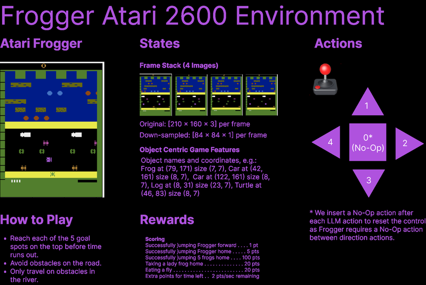

# Atari Frogger - DQN vs PPO
#### I detta projekt tränas två AI agenter för att spela Frogger med algoritmerna DQN och PPO från Stable-Baselines3.
### Miljö:

- Bild: https://www.researchgate.net/figure/States-actions-and-rewards-of-the-Atari-2600-Frogger-game-environment_fig1_391531510

# DQN
- DQN valdes eftersom det passar bra för miljöer med en discrete action space, som Frogger.
- I varje state räknas ett Q-värde per möjlig action, och agenten lär sig med tiden att förutsäga vilka actions som har högst framtida belöning.
- Eftersom observationerna kommer från Atari-konsolens RAM används MlpPolicy, som passar för icke-visuell input.
## Träning
- Optuna används för att optimera agentens hyperparametrar:
- `buffer_size = trial.suggest_int("buffer_size", 50000,2000000)`
  - Antalet *state transitions* (replays) `(s,a,r,s',done)` som kan sparas i replay buffer.
  - En stor buffer (500k-2milj) används för att lagra väldigt mångfaldig träningsdata.
- `batch_size= trial.suggest_categorical("batch_size", [32, 64])`
  - Antalet övergångar som plockas ur replay buffer för att uppdatera tidigare Q-värden under varje steg av training loopen.
  - Här övervägdes det om **Prioritized Experience Replay** skulle implementeras för att använda de mest "intressanta" replays, men eftersom spelet regelbundet ger belöningar *(inte bara **minus** för game over och **plus** för win)* verkade det inte behövas.
 ## DQN Resultat
 **100 trials kördes för att hitta den bästa kombinationen av hyperparametrar:**

 
 
- Bästa params:
  - `learning_rate` = `0.00006168198659813135`
  - `gamma` = `0.9725226742529088`
  - `layer_size` = `128`
  - `buffer_size` = `1917501`
  - `batch_size` = `64`
 
 **Den bästa kombinationen av inställningar som hittats används för att träna en agent för 500k timesteps:**

- Agenten lärde sig stadigt.
- Med flera timesteps kan jag tro att agenten kunde göra ett människolikt utförande.
- Vid rendering verkar agenten aldrig nå mål, men den klarar sig ganska långt fram i miljön.
